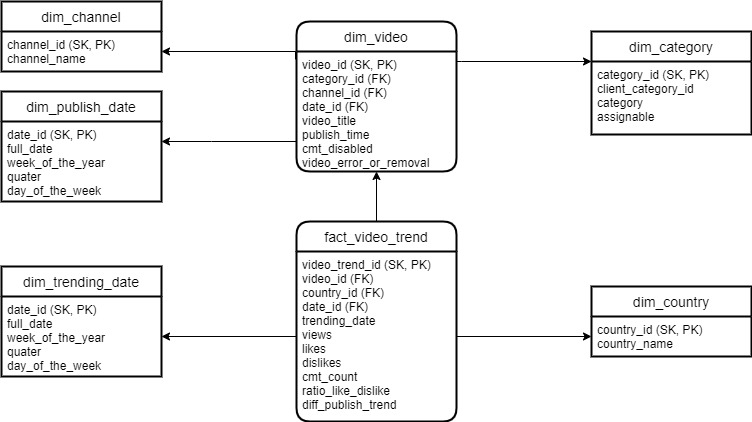

## Logical Modeling for youtube trending analysis

The following is the logical modeling of the data warehouse for the youtube trending analysis.

## Business Requirements

The following business requirements were identified:

We should be able to know the following:
* Which youtuber/channel has been consistently providing trending videos.
* Which category of video has been most liked in different countries.
* Which country has the highest number of viewers.
* Audience involvement with the youtuber.
* If there are any trending videos which have been removed.
* Time that a video took to arrive in the trending list after upload.
* Video which has been trending in multiple countries

Possible Requirement
* Date of trending/ period of trending
* Ratio of views and likes
* Ratio of likes and dislikes (To know if a video is on trending with good reviews)

## Data Modeling

The identified areas of interest in this project are:
* Video Trends
* popularity
* correlation between video statistics

## 1. Identfied Dimensions

The following dimensions were identified:
* `video` - Provides information regarding publish dates
* `channel` - Provides information about the channel, channel name.
* `category` - Provides information regarding the genre of the video.
* `date` - Provides time period for both publish and trending date.
* `country` - Provides information about the country in which the video was Trending.

## 2. Identified Fact

The following fact was identfied:
* `video_trend` - provides the statistical information regarding the videos in the trending list.

## 3. Identifying required attributes of the fact and dimension tables

The attributes identified for the fact and dimension tables are:

<table>
<tr>
<th>`dim_video` </th> 
<td>video_id, category_id, channel_id, date_id, video_title, publish_time, cmt_disabled, video_error_or_removal</td>
</tr>
<tr>
<th> `dim_channel` </th>
<td>channel_id, channel_name</td>
</tr>
<tr>
<th>`dim_category`</th>
<td>category_id, client_category_id, category, assignable</td>
</tr>
<tr>
<th>`dim_date` </th>
<td>date_id, full_date, week_of_the_year, quater, day_of_the_week
</td>
</tr>
<tr>
<th>`dim_country` </th>
<td>country_id, country_name</td>
</tr>
<tr>
<th>`fact_video_trend` </th>
<td>video_trend_id, video_id, country_id, date_id, trending_date, views, likes, dislikes,   cmt_count, ratio_like_dislike, diff_publish_trend</td>
</tr>
</table>

## 4.Logical model

